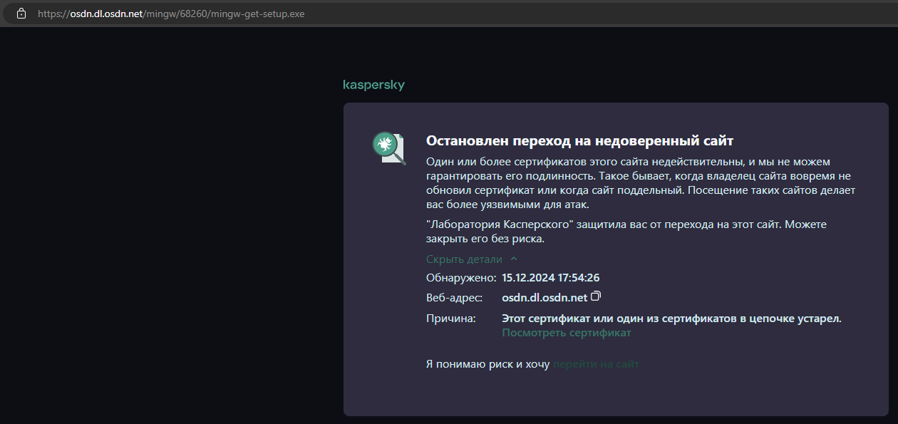
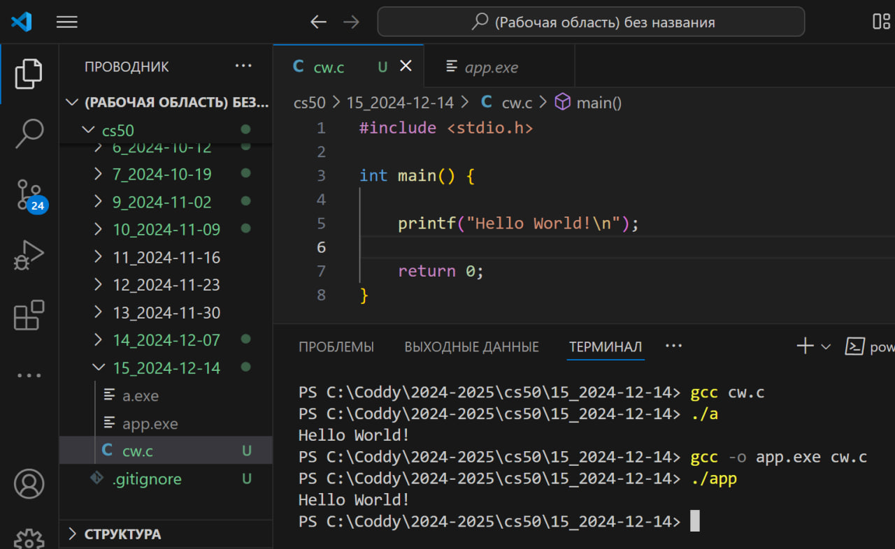

# К занятию 2024-12-21

На последнем занятии мы разобрали установили компилятор GCC

## Теория

### [Установка компилятора GCC и IDE MS VSCode](https://youtu.be/TGpYh9X1PYk?si=PmpKw7kF0ZtjsQ3O)

По ссылке из заголовка раздела - видеогайд по установке компилятора GCC и IDE MS Visual Studio Code. Смотрим - наслаждаемся.

[Прямая ссылка](https://osdn.net/projects/mingw/downloads/68260/mingw-get-setup.exe/) для скачивания установщика (надеюсь, она еще работает).

Может выскочить предупреждение о небезопасности соединения (у челиков просто сертификат на сайтике устарел, но ничего страшного). В таком случае все равно скачиваем и устанавливаем.

Например, у меня установлен антивирус от Касперского, который предупреждает о подобных ссылках. Я нажимаю "Перейти на сайт" - и скачивание происходит успешно.



### Windows CMD / Powershell

CMD и PowerShell - это командные интерпретаторы, предустановленные в системах симейства Windows. В них нам понадобятся несколько команд:

- `cd <path/to/directory>` (*change directory*) - компанда меняет текущую директорию (папку) на ту, путь к которой указан после нее. Если в пути к нужной директории встречаются пробелы, то весь путь нужно поместить внутрь кавычек:
    ```
    cd "C:\Inst\4 course\7 sem\Containers"
    ```
    Данная команда изменит текущую директорию на директорию `Containers`, лежащую в директории `7 sem`, лежащей в директории `4 course`, лежащей в директории `Inst`, лежащей на локальном диске `C`. Допускается в качестве разделителей между директорий использовать как прямой слэш (`/`), так и обратный (`\`).

- `gcc <c-file-name>` - вызов компилятора GCC (если установлен) для указанного файла. Если помимо имени файла указать флаг `-o` с каким-либо именем, то результирующий файл будет так называться:
    ```
    gcc -o result-exe-file.exe main.c
    ```
    Данная команда скомпилирует код файла `main.c` (написанный на языке C) и создаст на его основе исполняемый файл `result-exe-file.exe`.

- `./<exe-file-name>` - запускает переданный исполняемый файл. Если файл с расширением `exe`, то его можно опускать:
    ```
    ./app
    ```
    Данная команда запустит исполняемый файл `app.exe`.

С помощью горячих клавиш '`Ctrl`+`C`' можно экстренно прервать запущенную программу, не дожидаясь ее нормального завершения.

## Домашка

Выполнять задание можете в любом удобном редакторе кода, только учтите, что вы должны иметь возможность компилировать и запускать программу.

Рекомендую использовать:

1) VSCode с установленным компилятором, например, по одному из гайдов:
    - [#2. Установка компилятора gcc и Visual Studio Code на ОС Windows | Язык C для начинающих | selfedu | YouTube](https://youtu.be/TGpYh9X1PYk?si=d-czlTp61j4xqeGc) (предпочтительный вариант)
    - [Install gcc compiler 2024-11-16 | Katehok | YouTube](https://youtu.be/9h7KRt1w1Dc?si=g4nHwqL6HzXzmI0k)
2) Онлайн codespace от cs50: https://cs50.dev/
3) Онлайн IDE + компилятор: https://www.online-cpp.com/online_c_ide
4) MS Visual Studio
5) Любая другая связка редактора кода + компилятора

В любом случае, для сдачи домашки у вас должна быть возможность показать код мне. Как именно вы это сделаете - файл или архив файлов с кодом пришлете в ТГ или принесете их на флешке - не столь важно (единственное, код должен быть в виде текста, а не фотографии или скриншота). Учтите, что код должен быть полностью рабочим, то есть, мне достаточно будет лишь скомпилировать его, не внося никаких исправлений.

Напомню, что все задачи должны быть решены в одном файле в виде отдельных функций.

Помните: для каждой своей функции нужно создать прототип и поместить его до функции `main`, а сами реализации своих функций должны быть написаны уже после функции `main`, как это показано в [файле с урока](./last_hw.c) (можете использовать код из него в качестве примера).

### Задание

Необходимо установить компилятор GCC и IDE VSCode на ваш домашний компьютер, написать программу, печатающую на экран `Hello World!`, скомпилировать и запустить эту программу (смотрите видеогайд по ссылке из блока теории).

Результатом выполнения вещей работы должен быть скриншот из VSCode, где видно код программы, открытую в проводнике папку с файлом кода и исполняемым файлом, а также команды компиляции и запуска вашей программы.

